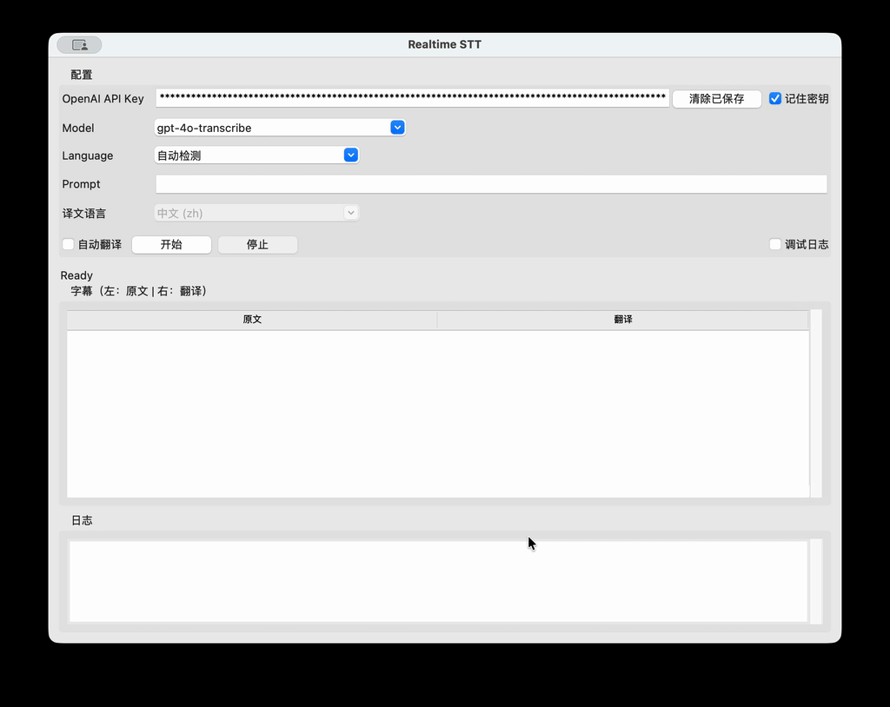
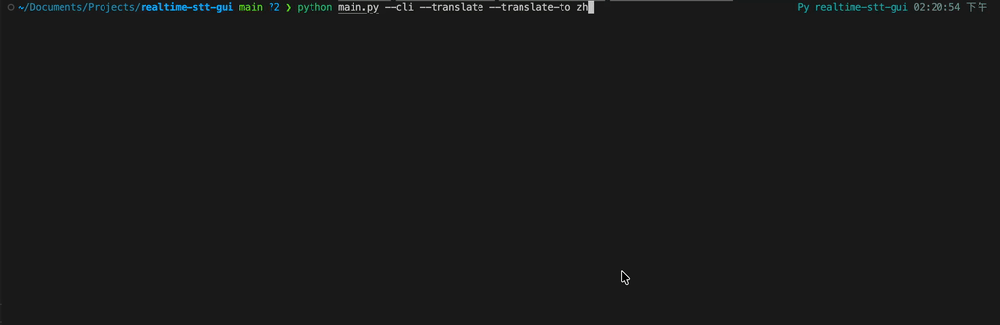

# realtime-stt-gui

本项目调用 OpenAI 的 Realtime WebSocket API 实现实时语音转写，并提供终端和 GUI 两种模式。

## 运行前准备

### 用 uv 部署环境

```bash
cd /Users/sigurd/Documents/Projects/realtime-stt-gui
export UV_CACHE_DIR=$(pwd)/.uv-cache
uv venv .venv
source .venv/bin/activate
uv pip install websocket-client pyaudio
```

如果要打包 .app，可继续：

```bash
uv pip install pyinstaller
```

注意：`UV_CACHE_DIR` 用于规避默认缓存目录无权限问题。

macOS 需要麦克风权限，首次运行时请在“系统设置 -> 隐私与安全性 -> 麦克风”允许终端/应用访问。

## 启动方式

### GUI（推荐）

```bash
python3 main.py
```

演示视频：



GUI 中新增“记住密钥”选项（勾选后会保存到 `~/.config/realtime-stt-gui/config.json`，明文存储）。下次启动会自动填充。
若你在日志里看到 `sk-svc...` 这种前缀，属于非标准 OpenAI API Key 场景，通常会返回 `invalid_api_key`；请确认使用的是平台 API Keys 列表里的 `sk-...` 或 `sk-proj-...`。

GUI 的 `Prompt` 输入框对应转写会话中的 `prompt`，它会随每次启动时的会话配置一起传给 OpenAI 的实时转写服务。
作用是提供上下文偏置，帮助模型更好识别你当前场景中的专有名词、术语、缩写、姓名等；例如医疗名词、产品名、口音较重场景。
如果不需要，可保持空；修改后会在下次点击 `开始` 时生效。对应 CLI 可用 `--prompt` 参数。

### 终端模式

```bash
OPENAI_API_KEY=... python3 main.py --cli
```

演示视频：



或

```bash
python3 main.py --cli --api-key YOUR_KEY
```

终端翻译参数：

```bash
python3 main.py --cli --translate --translate-to zh
```

- `--translate`：开启最终转写后的机器翻译输出。
- `--translate-to`：设置目标语言代码（例如 `en`、`zh`、`ja`）。
- `--save-key`：终端模式自动保存密钥到本地，下次启动自动读取。
- `--clear-saved-key`：清除本地保存的密钥并退出。

## 打包为 .app（macOS）

推荐使用 PyInstaller。

```bash
export UV_CACHE_DIR=$(pwd)/.uv-cache
uv pip install pyinstaller websocket-client pyaudio
./scripts/package_app.sh
```

或直接执行：

```bash
python3 -m PyInstaller RealtimeSTT.spec
```

脚本会在 `dist/` 下生成 `RealtimeSTT.app`。
